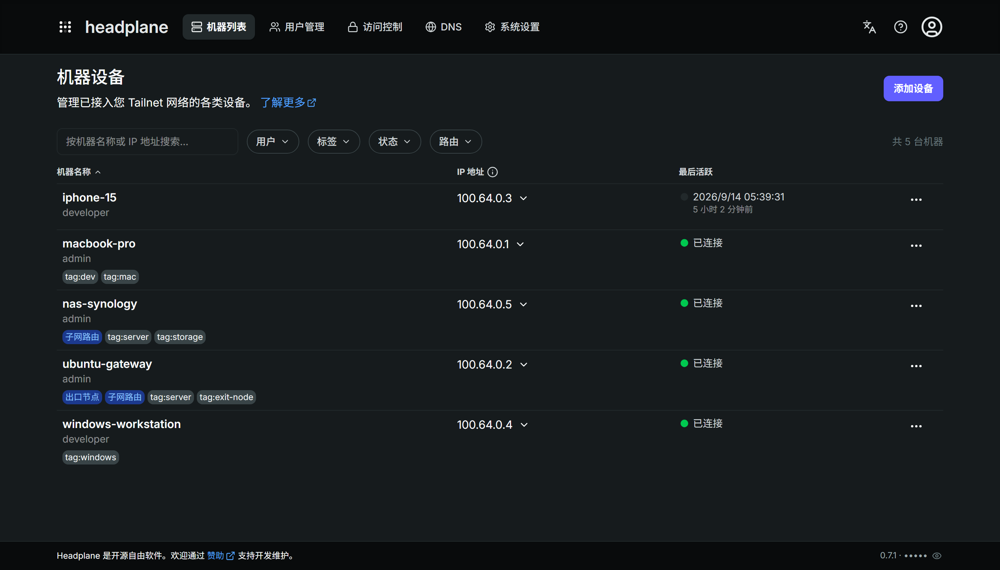
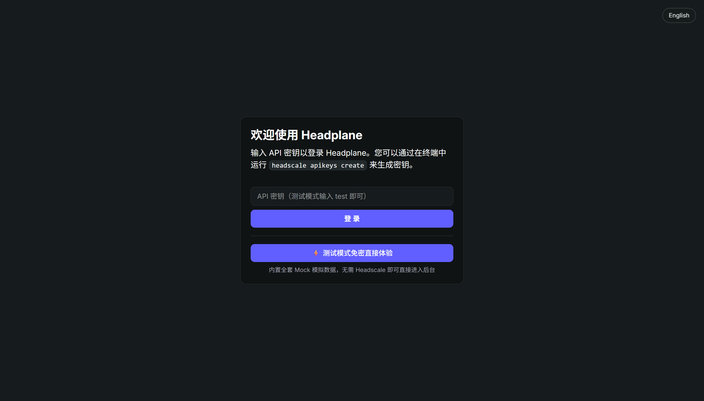
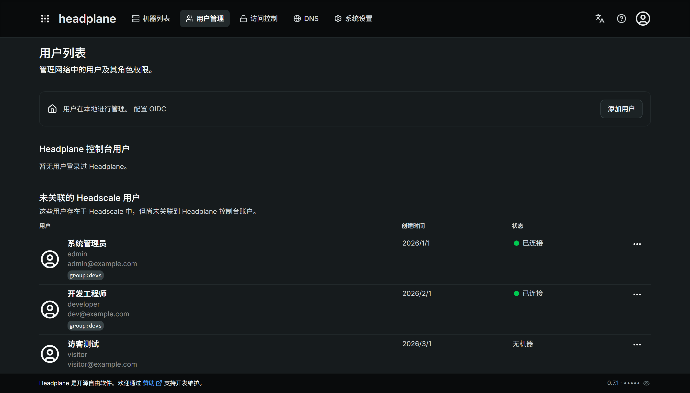
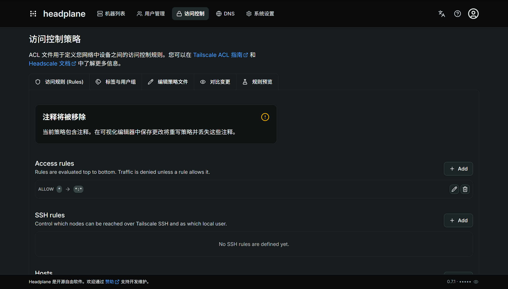
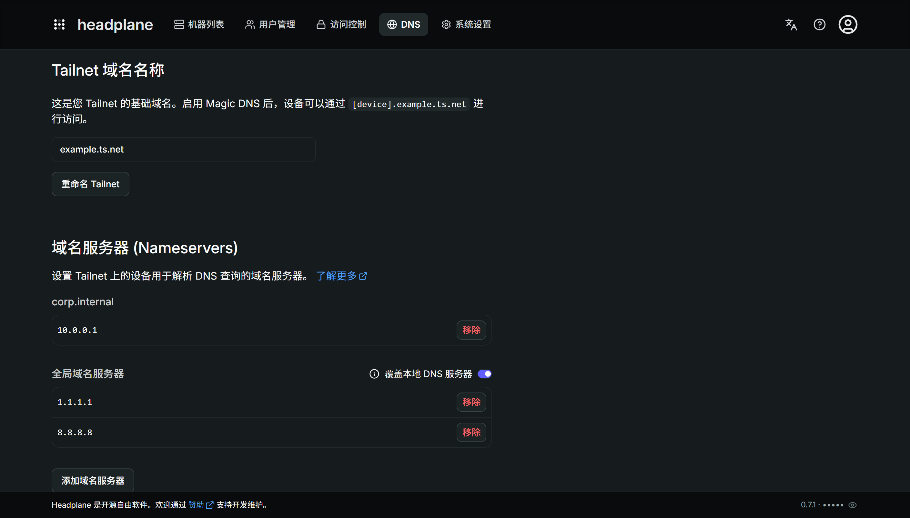
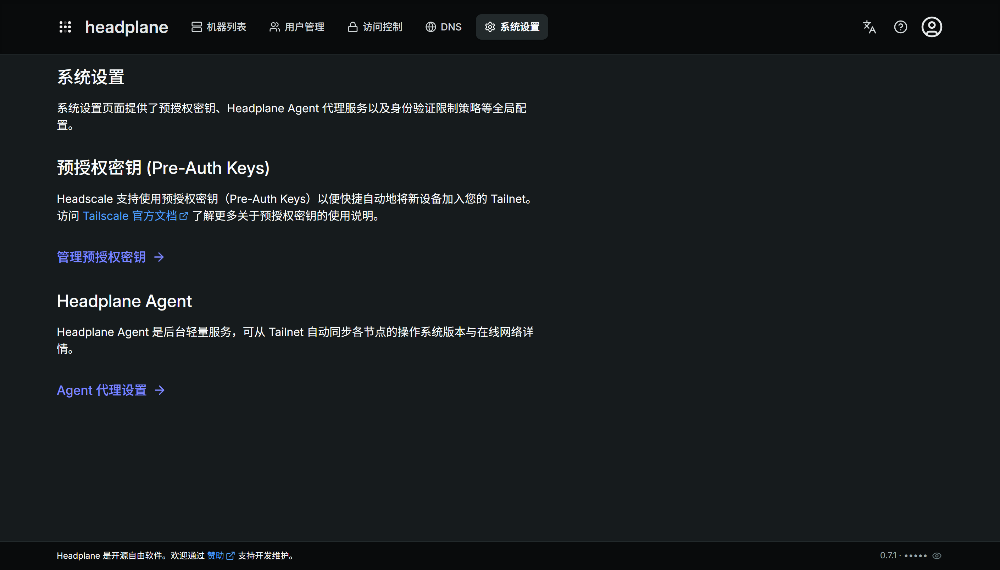

# Headplane (中文汉化增强版)

> 功能完备的 [Headscale](https://headscale.net) 现代化 Web 可视化管理面板。

🌐 **[English Documentation / 原英文原版文档](./README_EN.md)** | **简体中文**

---

<picture>
    <source
        media="(prefers-color-scheme: dark)"
        srcset="./docs/assets/zh-preview-dark.png"
    >
    <source
        media="(prefers-color-scheme: light)"
        srcset="./docs/assets/zh-preview-light.png"
    >
    
</picture>

## 项目简介

[Headscale](https://headscale.net) 是基于 WireGuard 的热门组网工具 Tailscale 事实上的开源自建控制服务器。原生 Headscale 仅提供命令行交互，缺乏直观的 Web 控制面板。

**Headplane** 致力于完美复刻 Tailscale 官方控制台的强大体验与现代感，是目前功能最完备的 Headscale 可视化管理面板。

本项目在此基础上提供了**全量简体中文本地化支持**、**高质感 UI 交互反馈优化**以及**零依赖本地预览体验（Dev Mock 模式）**。

---

## 本次更新内容（中文汉化与体验升级）

基于最新提交（`功能：添加中文版本以及优化UI`），本项目主要带来了以下核心改进：

### 1. 全量简体中文汉化与双语切换

- **全站汉化覆盖**：涵盖机器管理、用户权限、访问控制策略 (ACLs)、DNS 域名解析、系统全局设置、预授权密钥 (Pre-Auth Keys)、Agent 监控等所有页面。
- **无缝即时切换**：在顶部导航栏与登录界面均提供一键语言切换按钮，支持在简体中文（`zh`）与英文（`en`）间自由切换。
- **服务端 SSR 持久化解析**：语言偏好通过 Cookie（`headplane_lang`）持久化存储，并在服务端首屏渲染时直接生效，彻底消除页面刷新时的语言闪烁。

### 2. UI 动效与触感反馈优化

- **触感反馈（Micro-interactions）**：为按钮、菜单项、选项卡、弹窗以及开关组件添加了弹性微交互（`active:scale-[0.97]` 与平滑过渡过渡效果）。
- **交互手感提升**：优化了点击态、悬浮态与鼠标手势，告别原生界面生硬呆板的点击体验，带来更符合直觉的顺滑操作。

### 3. 内置免密体验与 Dev Mock 模式

- **脱离后端依赖**：内置全套基于内存的模拟数据集（包含预置的管理员用户、各类测试节点、ACL 规则等），无需连接真实 Headscale 即可直接体验完整后台。
- **一键快捷体验**：登录页面提供 **“⚡ 测试模式免密直接体验”** 入口（或输入 `test`），便于开发者和用户快速预览各模块界面及功能。

---

## 界面截图预览

### 登录页与双语切换

> 支持深色/浅色模式自适应，支持一键切换语言及免密快捷体验：

<p align="center">
  
</p>

### 用户管理

> 管理 Headscale 用户账号与 Headplane 控制台账户的关联绑定与权限：

<p align="center">
  
</p>

### 访问控制策略 (ACLs)

> 可视化配置网络设备间的访问规则、用户组与标签：

<p align="center">
  
</p>

### DNS 与域名设置

> 集中管理 Tailnet 基础域名、Magic DNS 以及公共/自定义域名服务器：

<p align="center">
  
</p>

### 系统全局配置

> 便捷生成预授权密钥（Pre-Auth Keys）以及配置 Headplane Agent 状态：

<p align="center">
  
</p>

---

## 核心特性一览

- 💻 **设备管理**：实时查看节点在线状态、IP 分配、路由广播（出口节点/子网路由）、标签配置、所有者转移及密钥过期管理。
- 🛡️ **ACL 策略控制**：支持可视化编辑和结构化配置访问规则、标签与用户群组。
- 🔑 **预授权密钥 (Pre-Auth Keys)**：批量生成可复用或一次性加入密钥，支持指定标签与过期时间。
- 🌐 **DNS 与 Nameserver**：完整支持 Magic DNS、Extra Records 以及自定义上游 DNS。
- 🔐 **认证与单点登录**：支持通过 API Key 登录，或集成 OpenID Connect (OIDC) 实现企业级单点登录。
- ⚡ **WebSSH 终端**：基于 WASM 的浏览器端即时终端，直接安全连接至 Tailnet 节点。

---

## 快速上手与体验

### 方案一：启动本地 Dev Mock 演示（无需 Headscale）

无需安装或配置 Headscale 服务端，即可在本地直接运行并体验中文界面：

```bash
# 1. 克隆仓库并安装依赖
git clone https://github.com/GoldenLight778/headplane-chinese.git
cd headplane-chinese
pnpm install

# 2. 启动开发 Mock 模式
pnpm run dev:mock
```

启动后在浏览器中访问：`http://localhost:3000/admin/`
点击登录页面的 **“⚡ 测试模式免密直接体验”**（或输入 API Key：`test`）即可畅享完整管理面板。

### 方案二：连接真实 Headscale 部署

参考根目录下的配置文件模板：

1. 复制配置文件：`cp config.example.yaml config.yaml`
2. 配置您的 Headscale 地址、API 密钥与服务端口。
3. 启动服务：`pnpm run build && pnpm start`

更多关于 Docker 部署、反向代理与详细配置，请查阅 [原官方文档网站](https://headplane.net) 与 [原英文文档](./README_EN.md)。

---

## 原版文档与参考链接

- 📖 **原英文 README**：[English README](./README_EN.md)
- 🌐 **Headplane 官方网站**：[headplane.net](https://headplane.net)
- 🐙 **Headplane 官方仓库**：[tale/headplane](https://github.com/tale/headplane)
- 🦭 **Headscale 官方文档**：[headscale.net](https://headscale.net)
- 🤝 **参与贡献指南**：[CONTRIBUTING.md](./docs/CONTRIBUTING.md)

---

> 原项目 Copyright (c) 2025 Aarnav Tale. 中文本地化由社区维护贡献。
